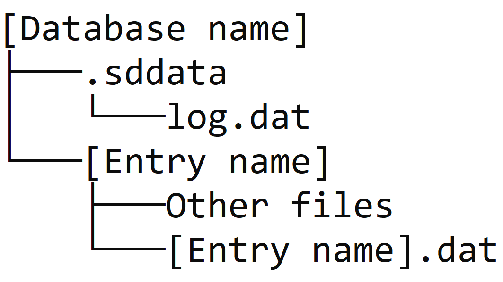

# Simple Database  
> Simple, thread safe database library with embedded file manager and logging functionality.  


## Table of contents
* [General info](#general-info)
* [Database structure](#database-file-structure)
* [Setup](#setup)
* [Code examples](#code-examples)
* [Features](#features)
* [Status](#status)
* [Contact](#contact)


## General info
This project's aims is to simplify the setup and use of a local database. The library is thread safe and easy to use. It automatically logs every change (in `.sddata\log.dat`) and updates them on file-level.


## Database file structure

>`.sddata` - is a unique folder that keeps all the relevant information about the database (__Do not delete__, otherwise database will __not__ be recognized on `connect` call).  
>`log.dat` - Log files, keeps track of all the changes withing the database.  
>`Other files` - Files that are uploaded to the entry and are copied in the database.  
>`[Entry name].dat` - Entry data file (Accessed through entry's `.uploadData`, `.getData` methods).


## Setup
### Method 1
1. Download `SimpleDatabase.jar`
2. In your IDE locate a setting for adding external .jar file
4. Add `SimpleDatabase.jar` to your project's dependencies
5. Enjoy your own database!

### Method 2
1. Clone or download files from GitHub
2. Place `sherp` folder from the downloaded `src` in your project's source
3. Enjoy your own database!


## Code Examples
### Creating new database 
Create a database named `Example Database` in your project's root folder:  
`Database exampleDatabase = Database.create("Example Database")`  
or  
create `Example Database` in `C:\Example path`:  
`Database exampleDatabase = Database.create("C:\\Example path", "Example Database")`

### Locating and connecting to an existing database  
_(Optional)_ Scan for existing databases and get an array of found names:  
`String[] names = Database.scan("C:\\Some path")`  
Connect to an existing database in project's root folder:  
`Database someDatabase = Database.connect("Some Database")`  
or  
connect to a database in a specific path:  
`Database exampleDatabase = Database.connect("C:\\Some path", "Some Database")`

### Adding files
__Important note: Use absolute file path (C:\path\file.extension)__  
The file paths, that are added to an entry, are stored in the local array. Only once an entry is added to the database all the files will be copied in that entry's folder.
```
Entry entry = new Entry("example");
entry.uploadFile("C:\\Example path\\file.example");
someDatabase.add(entry);
```

Then, every file change in the entry will be automatically picked up by the corresponding database and updated.  
```
Entry entry = someDatabase.get("example");
entry.uploadFile("C:\\Example path\\file.example");
```

After a successful upload, the file name in the entry files array is going to change to just that file's name.  
_If copying failed (either due to IO error or file not found error), that filepath will be removed from the entry._
```
Entry entry = new Entry("example");
entry.uploadFile("C:\\Example path\\file.example");
// entry.getFiles() -> [..., "C:\\Example path\\file.example", ...]
someDatabase.add(entry);
// entry.getFiles() -> [..., "file.example", ...]
```


## Features
* Simple and intuitive methods
* Complete file management automation
* Thread safety


## Status
###Project is _in progress_
### Todo list
* Improve file management between threads
* Add new entry method `setName(String newName)`


## Contact
Created by [@sherpavel](https://www.linkedin.com/in/sherpavel/) - feel free to contact me!
